

# Ryan 🧑🏻‍💻 Bakker

### Working under the hood of websites

---

Hi, I'm Ryan! A passionate developer currently studying for a Bachelor's in Computer Science, with a particular interest in software development and AI/ML. I am experienced in modern web development with both Next.js and WordPress. Utilizing SEO optimization techniques and server-side rendering for the optimal user experience. My current focus is on Next.js 15 and actively pursuing opportunities to dive into full-stack development. Excited to connect and collaborate.

---

## 🛠️ Experienced With

### Frontend

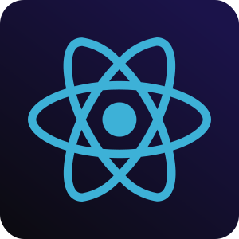
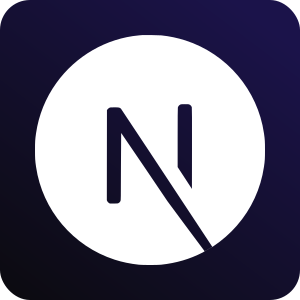

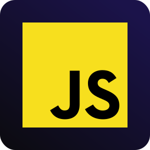
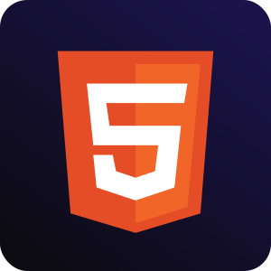
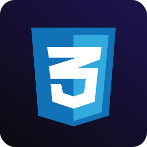
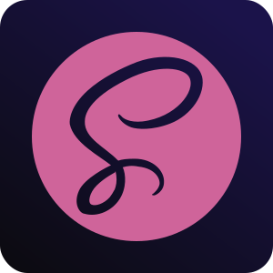
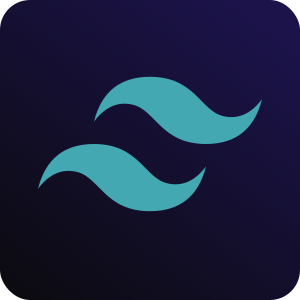

### Backend & Tools

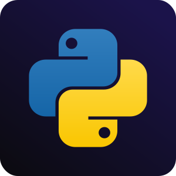
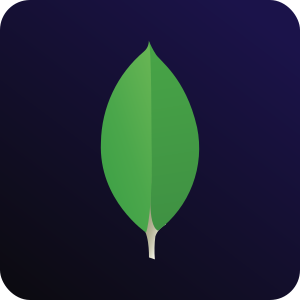
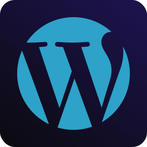
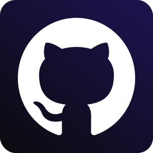

### Design & Collaboration

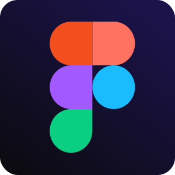
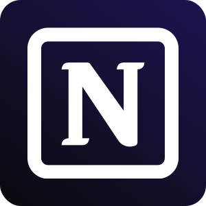
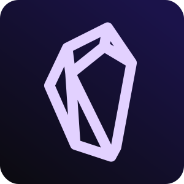
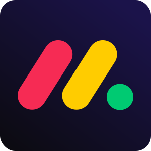
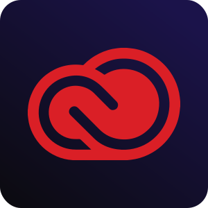

### Cloud & Authentication

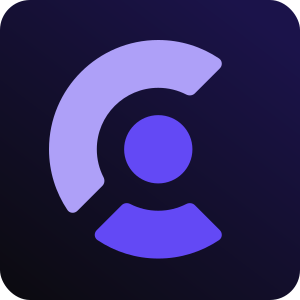

---

## 🚀 I'm Working On

### Learning Python

> I have recently started learning Python for a change and to try something new. I am in the early stages, but have so far really enjoyed it. My university classes on C, as well as my experience in developing with both Next.js and WordPress, have been a huge help. Allowing me to learn faster than someone starting from scratch typically would.

---

### Moneter Project

> This is a personal project I have been working on over the past couple of months, learning to utilize more advanced calculations and AI agents to enhance user experience. Moneter is a financial management dashboard with a subscription model, offering various price tiers for users needing different features.

---

## 📊 GitHub Stats

<table>
  <tr>
    <td>
      
    </td>
    <td>
      
    </td>
  </tr>
</table>

---

## 🤝 Let's Connect

Always open to discussing new projects, creative ideas, or opportunities to be part of your visions.

